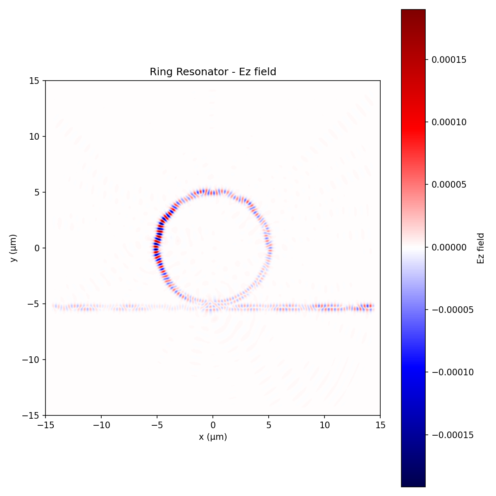

# 02 Ring Resonator

Simulated evanescent coupling between a silicon waveguide and a ring resonator at 1550nm communication wavelength.

## Device Parameters
- Ring radius: 5.0 μm
- Waveguide width: 500 nm
- Gap (waveguide to ring): 100 nm
- Core: Si (n = 3.48)
- Cladding: SiO2 (n = 1.44)

## Key Physics
Light traveling in the waveguide evanescently couples into the ring when the round-trip phase satisfies the resonance condition: 2πr · n_eff = m · λ

At resonance, power is transferred from the waveguide into the ring, causing a dip in transmission — the basis for ring resonator filters and modulators in silicon photonics.

## Result

Light couples from the waveguide (horizontal) into the ring, circulating inside the resonator structure. Higher field intensity on the left side of the ring reflects the input coupling point, where light first evanescently transfers from the waveguide into the ring resonator.
