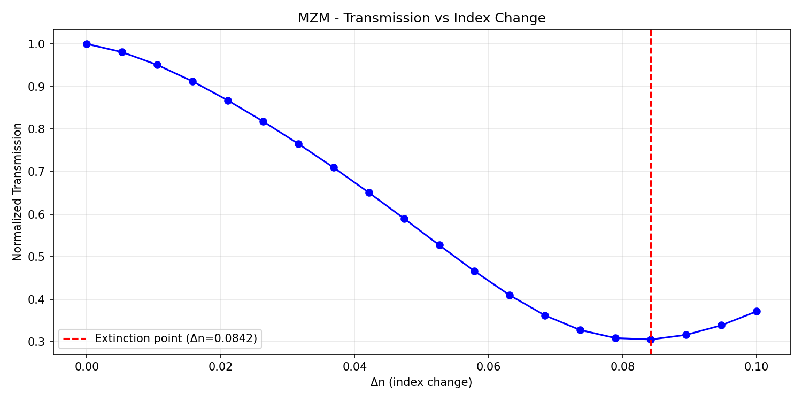

# 03 Mach-Zehnder Modulator (MZM)

Simulated electro-optic modulation in a Mach-Zehnder Modulator by sweeping refractive index change (Δn) in one arm to find the extinction point.

## Device Parameters
- Waveguide width: 500 nm
- Arm length: 10 μm
- Core: Si (n = 3.48)
- Cladding SiO2 (n = 1.44)

## Key Physics
Applying voltage to one arm changes its refractive index via the electro-optic effect, introducing a phase shift between the two arms. When the phase difference reaches π, destructive interference at the output gives minimum transmission — the extinction point. 

This directly connects to my PhD research on ferroelectric nematic liquid crystals, which exhibit large electro-optic responses.

## Result

**Extinction point: Δn = 0.0842**
Transmission drops to minimum at Δn = 0.0842, corresponding to a π phase shift in the modulated arm. 

## Files
- 'mzm_sweep.py' — delta_n sweep simulation
- 'mzm_sweep.png' - transmission vs index change