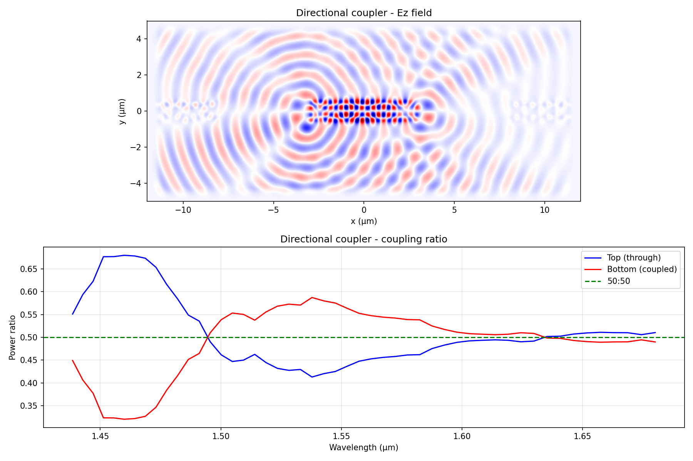

# 04 Directional Coupler

Simulated evanescent coupling between two parallel silicon waveguides and characterized wavelength-dependent coupling ratio.

## Device Parameters
- Waveguide width: 500 nm
- Gap between waveguides: 200 nm
- Coupling length: 6.0 μm
- Core: Si (n = 3.48)
- Cladding: SIO2 (n = 1.44)

## Key Physics
When two waveguides are placed close together, the evanescent field of one waveguide overlaps with the other, causing power to transfer between them. The fraction of power transferred depends on the coupling length and wavelength.

At the 50:50 point, equal power is distributed between the two output ports — making this the building block for beam splitter and Mach-Zehnder modulators in photonic integrated circuits.

## Result

- Light is injected into the top waveguide only
- At ~1.50 μm, coupling ratio crosses 50:50
- Coupling ratio is wavelength-dependent, enabling wavelength-selective switching applications

## Files
- 'directional_coupler.py' - simulated code
- 'directional_coupler.png' - Ez field + coupling ratio

